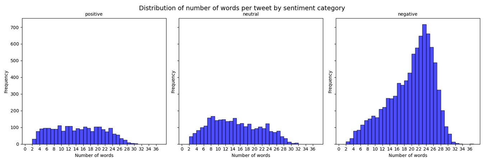

# Flight Experience Sentiment Analysis Project

## 📌 Introduction

This project aims to build an intelligent system capable of **predicting the sentiment of user comments about flight experiences**. For this purpose, a dataset from Kaggle was used, containing **real tweets from passengers** about flights with different airlines.

The ultimate goal is to develop a **production-ready web application** where users can share their opinions about their flights, and the system, using natural language processing (NLP) models, automatically classifies the comments as **positive**, **negative**, or **neutral**.

This way, airlines can use the collected information to:

- Monitor customer satisfaction in real-time.
- Identify areas for service improvement.
- Make data-driven decisions.

## 📊 Dataset

The dataset was extracted from Kaggle and can be found at the following link:  
[Sentiment Analysis of Airline Tweets and Comments](https://www.kaggle.com/code/serkanp/sentiment-analysis-of-airline-tweets-and-comments)

It is a CSV file containing **15 columns** and **14,640 rows** of tweets from users sharing their flight experiences.

The key variables used in this project are:  
- **text**: The tweet text published by the user about their flight experience with a specific airline.  
- **airline_sentiment**: The target variable, which classifies the sentiment of the experience into **positive**, **negative**, or **neutral**.

These two variables are the core of the sentiment analysis modeling.

## 🧪 Model Development

In this stage, I focused on obtaining the best possible model to deploy in a production environment. To achieve this, I conducted an exploratory data analysis that helped me understand the behavior of the text and evaluate whether it was feasible to use more traditional probabilistic models, such as **Naive Bayes**.

I also performed thorough text preprocessing, selected appropriate evaluation metrics, and tested various models, comparing their performance using **fine-tuning techniques**. This process allowed me to select the most robust model in terms of **accuracy** and **generalization**.

### 📊 EDA (Exploratory Data Analysis)

In this section, I performed an exploratory analysis of the **text** variable in relation to the **airline_sentiment** label.  
The goal was to identify **statistical patterns** that help understand how the textual data is structured depending on the sentiment (positive, neutral, or negative).

Some of the key analyses included:

- **Number of words per tweet**
- **Number of unique words per tweet**
- **Average word length per tweet**
- **Total number of characters per tweet**
- Class balance across sentiment categories

This EDA step was essential to assess the **feasibility of simpler models** and guided decisions in **text cleaning**, **tokenization**, and **feature selection**.

---

### 🧠 Insights from Exploratory Analysis

From the exploratory analysis of the text data, several key insights emerge:

- **Tweet Length (in words):**  
  Negative tweets tend to be longer on average, peaking around 22–25 words. In contrast, positive and neutral tweets are generally shorter and more dispersed. This suggests that users are more verbose when expressing dissatisfaction.
  

- **Number of Unique Words:**  
  Negative tweets also exhibit a higher number of unique words per tweet, indicating a richer vocabulary likely used to detail complaints. Positive and neutral tweets show a more modest and uniform distribution of unique terms.


- **Average Word Length:**  
  Across all sentiment categories, the average word length remains fairly stable, typically between 4 and 6 characters. This implies that while users may write more when unhappy, the complexity of the vocabulary used does not vary significantly with sentiment.
  

- **Tweet Length (in characters):**  
  Similar to word count, tweets labeled as negative often reach the character limit (140–160 characters), whereas positive and neutral tweets are generally shorter. This reinforces the idea that users elaborate more when describing negative experiences.
  
**Conclusion:**  
These insights confirm that **tweet length and lexical diversity are strong indicators of sentiment polarity**. Negative feedback is usually more detailed, which can be leveraged in model training by including features related to text length or richness. This justifies exploring more advanced models capable of capturing nuanced language patterns beyond simple keyword-based approaches.

- **Class Balance Across Sentiment Categories**
The dataset shows a clear imbalance across sentiment categories. The **negative** class dominates with over **8,600 tweets**, while the **neutral** and **positive** classes have approximately **2,900** and **2,100** samples, respectively.

While this imbalance might suggest the need for resampling techniques such as **oversampling** or **undersampling**, it's important to consider the implications:

- **Undersampling** the majority class (negative) could lead to **information loss**, which is especially harmful when using deep models like **BERT** that benefit from large and diverse datasets.
- **Oversampling** the minority classes may introduce **overfitting**, particularly if the same samples are repeated multiple times during training.


---

### 🧹 Data Cleaning

At this stage, the `text` variable — containing the user tweets — was preprocessed to remove noise that could negatively affect model performance. Tweets often include a variety of elements that do not contribute to sentiment analysis and can mislead or clutter the learning process.

The following cleaning operations were applied:

- 🔗 **Removing URLs:** Links were stripped from the text since they provide no useful sentiment information and can distort vector representations.
- 🧑‍💻 **Replacing user mentions:** Mentions (e.g., `@username`) were replaced with a generic placeholder to preserve structure without introducing noise.
- 😀 **Removing emojis:** Emojis were removed to simplify the text and maintain consistency across samples.
- 🙂 **Eliminating emoticons:** Classic emoticons like `:)` or `:(` were also removed, as they may not be interpreted reliably by standard tokenizers.
- #️⃣ **Removing the '#' from hashtags:** Hashtag symbols were deleted while preserving the associated words (e.g., `#delayed` → `delayed`) to retain semantic meaning.
- ␣ **Normalizing whitespace:** Extra spaces were removed to avoid tokenization issues.

These preprocessing steps were crucial to creating a **clean and standardized corpus**, which improves the **quality of tokenization and vectorization**, and ultimately enhances the model’s accuracy and robustness.

---

### 🔄 Variable Transformation

Before detailing the specific transformations applied, it's important to note that multiple models were tested prior to selecting the final one. These included:

- **Naive Bayes**
- **Simple feedforward neural networks**
- **Recurrent neural networks (RNNs)**

Each of these models required input features in **different formats**, so the text data needed to be transformed accordingly.

The following transformations were applied:

- 📈 **TF-IDF (Term Frequency – Inverse Document Frequency):**  
  Used as input for both Naive Bayes and deep feedforward neural networks. This method converts text into sparse numeric vectors by capturing the importance of each word in a document relative to the entire corpus.

- 🔤 **Word Embeddings with Word2Vec:**  
  Applied in the case of recurrent neural networks (RNNs), where each word was transformed into a dense, fixed-size vector. These embeddings capture semantic relationships between words and were either pretrained or trained on the dataset itself.

Finally, the model selected for deployment was based on **Transformers**, specifically using **BERT** with **fine-tuning of the last layers** (this process will be explained in more detail in a later section).

To feed the text data into BERT, the input was **tokenized** into tensors using a pre-trained BERT tokenizer. This process generated two key components:

- **`input_ids`**: the encoded representation of each token (word/subword) in the input text.
- **`attention_mask`**: a binary mask that indicates which tokens should be attended to (`1`) and which are padding (`0`). This helps BERT ignore padded tokens during computation.

On the other hand, the target variable (`airline_sentiment`), originally a column containing the string labels **"positive"**, **"neutral"**, and **"negative"**, was converted into a **numeric tensor** with values:

- `0` → positive  
- `1` → neutral  
- `2` → negative

This transformation allowed the model to perform **multi-class classification** efficiently using a categorical loss function like **CrossEntropyLoss**.

---

### 🧠 Model Training with BERT

After selecting BERT as the final architecture, the dataset was split into training, validation, and test sets to assess generalization performance:

- The model was trained on the training set.

- It was evaluated on the validation set after each epoch.

- Finally, it was tested on unseen data to assess its real-world performance.

The final model used was:

```python
from transformers import BertForSequenceClassification

model = BertForSequenceClassification.from_pretrained('bert-base-uncased', num_labels=3) 
```

⚙️ **Optimization and Metrics**

To train and evaluate the model effectively, the following configuration was used:

- Optimizer: AdamW, a variant of the Adam optimizer tailored for Transformers, with a learning rate of 3e-5.

- Loss Function: CrossEntropyLoss, well-suited for multi-class classification.

- Evaluation Metrics:

    - Weighted Precision

    - Weighted Recall

These metrics were calculated using torchmetrics, taking class imbalance into account for both training and validation phases.

🏆 **Best Model Selection Strategy**

To ensure optimal model performance, a validation-based checkpointing approach was used:

- After every epoch (and intermittently during training), the model’s performance on the validation set was evaluated.

- If the validation precision improved, the current model state was saved using:

```python
torch.save(best_model_state, "mejor_modelo_por_precision.pt")
```
This approach ensured that the best model — in terms of correctly classifying sentiments — was retained and later deployed.

---

## 📈 Final Results

For training, a **GPU provided by Google Colab** was used, which significantly accelerated the fine-tuning of the BERT model.

The final model achieved an **F1-score (weighted average) of 0.84** on both the validation and test sets, indicating:

- **Strong generalization performance**
- **No signs of overfitting**
- **~10 percentage point improvement** over other models (Naive Bayes, feedforward and recurrent neural networks)

This performance gain is likely due to **BERT's capacity to capture contextual information** across entire sentences, allowing it to better understand sentiment nuances.

Below are the classification metrics obtained on the **test set**:


### 🔍 Class-wise Analysis

- **Positive (0)**: The model achieves **0.84 precision** and **0.76 recall**, resulting in an **F1-score of 0.80**. This means it correctly identifies many positive tweets, though some are misclassified as neutral or negative. Still, when it predicts "positive", it is usually right.

- **Neutral (1)**: This is the most challenging class for the model, with the lowest **F1-score (0.69)**, **precision (0.71)**, and **recall (0.68)**. This likely stems from the ambiguous nature of neutral language, which often overlaps with both positive and negative expressions.

- **Negative (2)**: This is where the model performs best. With a **0.90 F1-score** and **0.92 recall**, it captures nearly all negative tweets, and with very high **precision (0.89)**. This strong performance is expected due to the abundance and clarity of negative expressions in the dataset.


**Conclusion**:  
The BERT model not only outperforms classical approaches, but also manages to maintain balanced performance across classes — especially impressive given the dataset's **class imbalance**. Fine-tuning on contextualized word embeddings clearly paid off.

---

## 🚀 Production Deployment

To deploy the sentiment classification system, a **production-ready architecture** was implemented, allowing users to access the application through **login or registration**.

### 🔧 Backend with FastAPI

The backend was developed using **FastAPI** and exposes the following main `POST` endpoints:

- `/register`: Allows users to create an account  
- `/login`: Authenticates users and returns an access token  
- `/predict`: Receives a text input and returns a sentiment prediction along with a personalized, empathetic message

Example responses based on sentiment:

- **positive**:  
  `"We're happy to hear your experience was good! We hope to have you flying with us again soon."`

- **neutral**:  
  `"Thank you for your feedback! We are constantly working to improve our service."`

- **negative**:  
  `"We're truly sorry for your experience. We will get in touch with you to improve anything that needs attention."`

This approach simulates a **real-world customer service response** tailored to the detected sentiment.

All endpoints are automatically documented through FastAPI's interactive interface at `/docs`, making them easy to test and integrate.

### 🛠️ Authentication and Database

To manage user accounts, a **SQL (PostgreSQL)** database was created using **Supabase**, where the following data is stored:

- Registered user information  
- Encrypted passwords

The **backend** handles communication with the database to authenticate users. The **frontend never directly accesses** sensitive data, ensuring greater security.

### 🔐 Security and Encryption

Password protection is implemented using **bcrypt** encryption, following industry best practices. Additionally:

- **JWT tokens** are used for authentication after login  
- Only authenticated users can access the `/predict` endpoint  
- Passwords are never stored in plain text

```python
pwd_context = CryptContext(schemes=["bcrypt"], deprecated="auto")
oauth2_scheme = OAuth2PasswordBearer(tokenUrl="/login")

